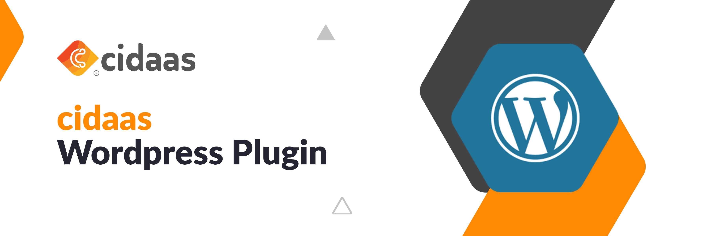

## About cidaas:
[cidaas](https://www.cidaas.com)
 is a fast and secure Cloud Identity & Access Management solution that standardises what’s important and simplifies what’s complex.

## Feature set includes:
* Single Sign On (SSO) based on OAuth 2.0, OpenID Connect, SAML 2.0 
* Multi-Factor-Authentication with more than 14 authentication methods, including TOTP and FIDO2 
* Passwordless Authentication 
* Social Login (e.g. Facebook, Google, LinkedIn and more) as well as Enterprise Identity Provider (e.g. SAML or AD) 
* Security in Machine-to-Machine (M2M) and IoT

=== Login using cidaas ===

Contributors : gopimallela
Tested up to: 5.4.1
Tags: Single Sign On, SSO, Login, Authentication, Authorization, CIAM, OpenID Connect, OIDC, OAuth, OAuth 2.0
Stable tag: trunk
License: GPLv2 or later
License URI: http://www.gnu.org/licenses/gpl-2.0.html

Striking the perfect balance between security and comfort - unique user identification and the highest level of security

== Description ==

This plugin allows to authenticate users against Cidaas identity server with Authorization Code Flow.
Once installed, it can be configured to automatically authenticate users (SSO), or provide a "Login with Cidaas"
button on the login form. After consent has been obtained, an existing user is automatically logged into WordPress, while 
new users are created in WordPress database.

== Installation ==

1. Upload to the `/wp-content/plugins/` directory or Download it from plugin repository
1. Activate the plugin
1. Visit Settings > Cidaas and configure to meet your needs

For more information on installation visit : 

